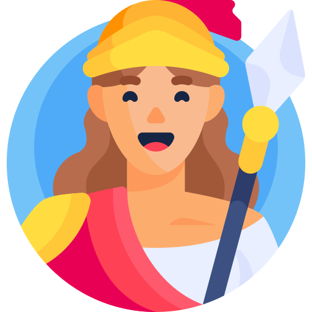
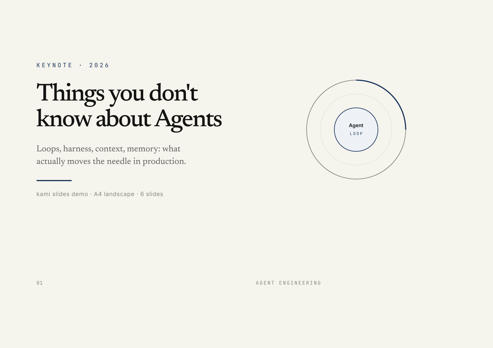
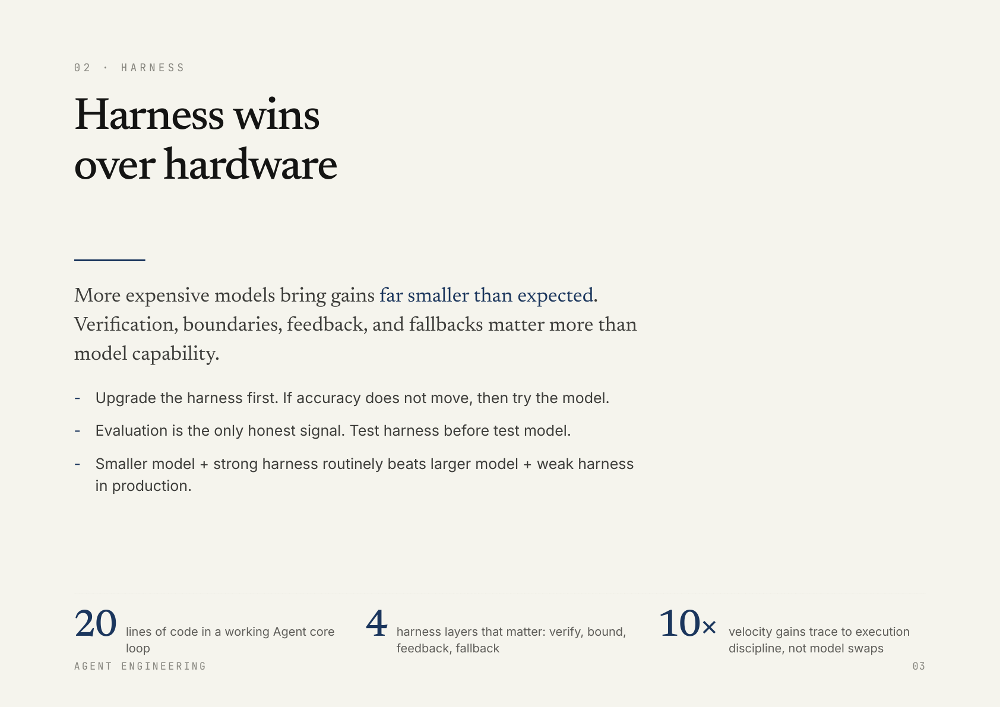

<div align="center">
  
  <h1>Kami</h1>
  <p><b>The paper your deliverables land on.</b></p>
  <a href="https://github.com/tw93/kami/stargazers"></a>
  <a href="https://github.com/tw93/kami/releases"></a>
  <a href="LICENSE"></a>
  <a href="https://twitter.com/HiTw93"></a>
</div>

<br/>

## Why

Kami (紙, かみ) is the Japanese word for paper: the quiet surface on which a finished idea finally lands.

Most document design drifts into two failure modes: generic corporate gray, or SaaS hype gradients. Neither reads like something a person actually made with care.

Kami holds one design idea across every format: warm parchment canvas, a single ink-blue accent, serif for authority, sans for utility, editorial whitespace tuned for print. Inspired by Anthropic's visual language.

It is part of the `Kaku · Waza · Kami` trilogy: Kaku (書く) is how you write code, Waza (技) is the habits you practice, Kami (紙) is the paper your work ships on.

## Install

**Claude Code**

```bash
npx skills add tw93/kami -a claude-code -g -y
```

**Codex**

```bash
npx skills add tw93/kami -a codex -g -y
```

**Claude Desktop**

[Download ZIP](https://github.com/tw93/kami/archive/refs/heads/main.zip), open Customize > Skills > "+" > Create skill, upload the ZIP.

## See it

Just tell Claude what you need: "帮我生成一份白皮书", "生成一份项目方案", "build me a resume", "写一份推荐信", "make a slide deck for my talk", "帮我做一份作品集". The skill auto-triggers, no slash command needed.

<table>
<tr>
  <td align="center" width="25%">
    <a href="assets/demos/demo-tesla.pdf"></a>
    <br><b>One-Pager</b> · 中文
    <br><sub>Tesla 公司介绍 · 单页 · <a href="assets/demos/demo-tesla.pdf">PDF</a></sub>
  </td>
  <td align="center" width="25%">
    <a href="assets/demos/demo-agent-slides.pdf"></a>
    <a href="assets/demos/demo-agent-slides.pdf"></a>
    <br><b>Slides</b> · English
    <br><sub>Agent keynote, 6 slides · <a href="assets/demos/demo-agent-slides.pdf">PDF</a></sub>
  </td>
  <td align="center" width="25%">
    <a href="assets/demos/demo-musk-resume.pdf"></a>
    <br><b>Resume</b> · English
    <br><sub>Founder CV, 2 pages strict · <a href="assets/demos/demo-musk-resume.pdf">PDF</a></sub>
  </td>
  <td align="center" width="25%">
    <a href="assets/demos/demo-kaku.pdf"></a>
    <br><b>Portfolio</b> · 中文
    <br><sub>Kaku 项目作品集 · 6 页 · <a href="assets/demos/demo-kaku.pdf">PDF</a></sub>
  </td>
</tr>
</table>

## Design

Six document types, each with Chinese and English variants: One-Pager, Long Doc, Letter, Portfolio, Resume, and Slides. Three inline SVG diagram primitives also ship. Kami picks the right variant based on the language you write in.

Eight invariants hold across every document:

1. Page background `#f5f4ed` parchment, not pure white
2. Single accent color: ink-blue `#1B365D`
3. All neutrals warm-toned. No `#6b7280`, no `#888`
4. English: serif for headlines and body. Chinese: serif headlines, sans body. Sans for UI elements only
5. Serif weight locked at 500. No bold headlines
6. Line-heights: tight headlines 1.1 to 1.3, dense body 1.4 to 1.45, reading body 1.5 to 1.55. Never 1.6+
7. Tag backgrounds must be solid hex. `rgba()` triggers a WeasyPrint double-rectangle bug
8. Depth via ring shadow or whisper shadow. No hard drop shadows

**Chinese fonts**: TsangerJinKai02 serif + Source Han Sans. TsangerJinKai is a commercial font, for commercial use please obtain a license from [tsanger.cn](https://tsanger.cn). Fallback: Noto Serif CJK SC, Songti SC, Georgia.

**English fonts**: Newsreader serif for headlines and body + Inter sans for UI elements only, both OFL open source. Fallback: Charter/Georgia, Helvetica Neue/Arial.

Full spec: [references/design.md](references/design.md), [references/design.en.md](references/design.en.md). Cheatsheet: [CHEATSHEET.md](CHEATSHEET.md), [CHEATSHEET.en.md](CHEATSHEET.en.md).

## Background

I invest in US equities and regularly ask AI to generate analysis reports. The output always looked like a default Google Doc: bland, inconsistent, forgettable. I can't stand ugly documents, especially when every report comes out looking different from the last one. So I kept tweaking the typography, colors, and spacing until I had something I actually wanted to read.

Then I was invited to present a talk based on my article "The Agent You Don't Know: Principles, Architecture, and Engineering Practice" and needed a slide deck that matched the same standard. That round pushed the system further, adding inline SVG diagrams, a consistent warm palette, and tighter editorial rhythm. Eventually it was doing enough that I pulled it into its own package. That became kami: one visual language I like, applied to everything I ship.

## Support

- If kami helped you, [share it](https://twitter.com/intent/tweet?url=https://github.com/tw93/kami&text=Kami%20-%20A%20quiet%20design%20system%20for%20professional%20documents.) with friends or give it a star.
- Got ideas or bugs? Open an issue or PR.
- I have two cats, TangYuan and Coke. If you think kami delights your life, you can feed them <a href="https://miaoyan.app/cats.html?name=Kami" target="_blank">canned food 🥩</a>.

<div align="center">
  <a href="https://miaoyan.app/cats.html?name=Kami"></a>
</div>

## License

MIT License. Feel free to use kami and contribute.
