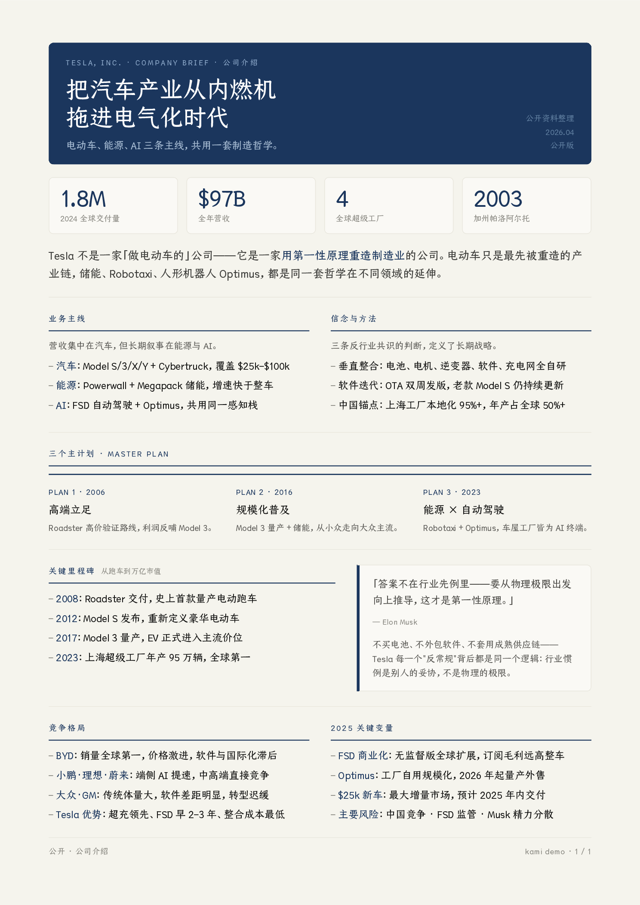
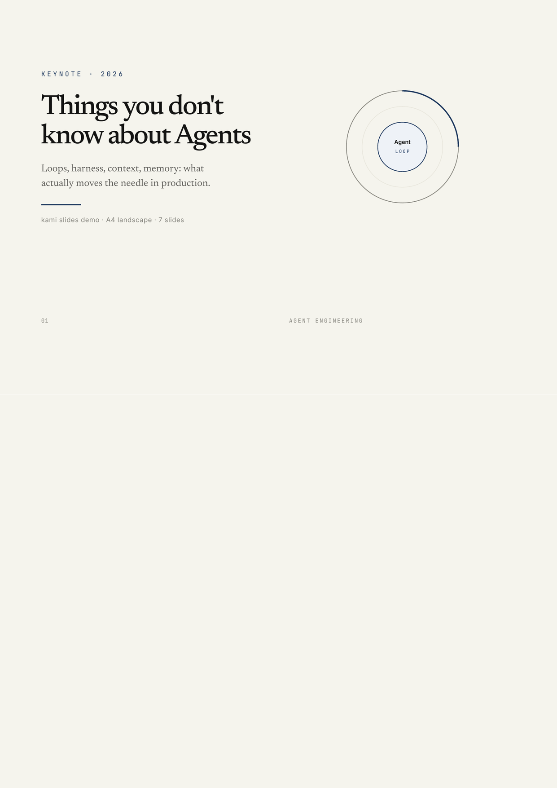
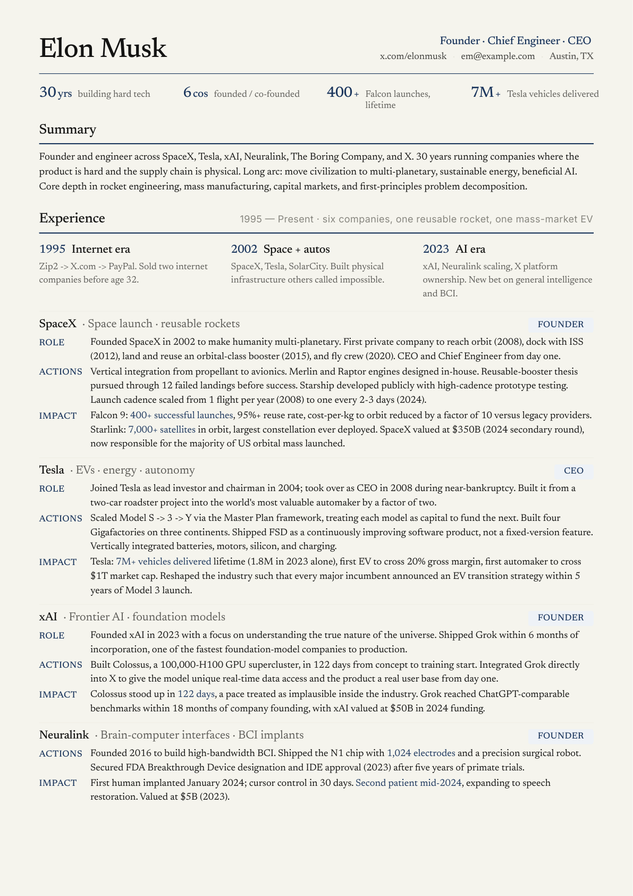
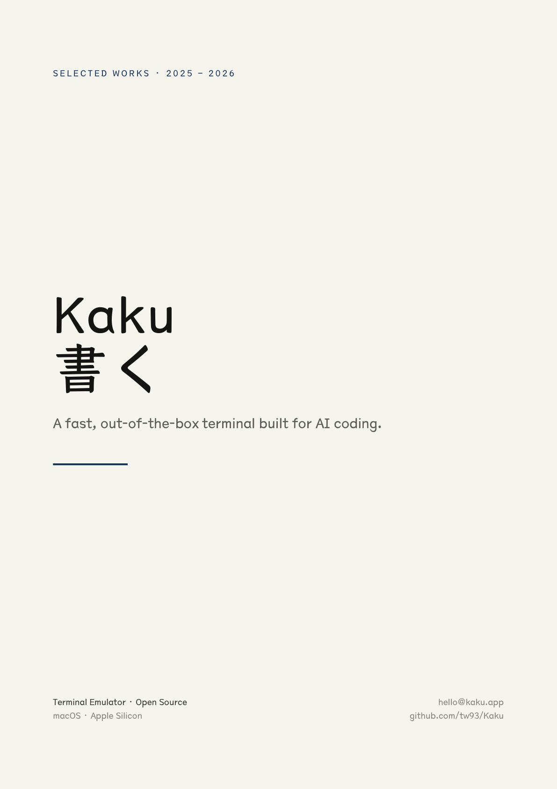

<div align="center">
  
  <h1>Kami</h1>
  <p><b>Good content deserves good paper.</b></p>
  <a href="https://github.com/tw93/kami/stargazers"></a>
  <a href="https://github.com/tw93/kami/releases"></a>
  <a href="LICENSE"></a>
  <a href="https://twitter.com/HiTw93"></a>
</div>

<br/>

## Why

Kami (紙, かみ) is the Japanese word for paper: the quiet surface on which a finished idea finally lands. Most document design drifts into two failure modes: generic corporate gray, or SaaS hype gradients. Neither reads like something a person actually made with care.

Kami holds one design idea across every format: warm parchment canvas, a single ink-blue accent, serif for authority, sans for utility, editorial whitespace tuned for print. It is part of a trilogy: [Kaku](https://github.com/tw93/Kaku) (書く) writes code, [Waza](https://github.com/tw93/Waza) (技) drills habits, [Kami](https://github.com/tw93/Kami) (紙) ships documents.

## See it

<table>
<tr>
  <td align="center" width="25%">
    <a href="assets/demos/demo-tesla.pdf"></a>
    <br><b>One-Pager</b> · 中文
    <br><sub>Tesla 公司介绍 · 单页</sub>
  </td>
  <td align="center" width="25%">
    <a href="assets/demos/demo-agent-slides.pdf"></a>
    <br><b>Slides</b> · English
    <br><sub>Agent keynote, 6 slides</sub>
  </td>
  <td align="center" width="25%">
    <a href="assets/demos/demo-musk-resume.pdf"></a>
    <br><b>Resume</b> · English
    <br><sub>Founder CV, 2 pages</sub>
  </td>
  <td align="center" width="25%">
    <a href="assets/demos/demo-kaku.pdf"></a>
    <br><b>Portfolio</b> · 中文
    <br><sub>Kaku 项目作品集 · 6 页</sub>
  </td>
</tr>
</table>

## Usage

**Claude Code**

```bash
npx skills add tw93/kami -a claude-code -g -y
```

**Codex**

```bash
npx skills add tw93/kami -a codex -g -y
```

**Claude Desktop**

[Download from Releases](https://github.com/tw93/kami/releases), open Customize > Skills > "+" > Create skill, upload the ZIP.

The skill auto-triggers when you describe what you need, no slash command required.

> make a one-pager for my startup / build me a resume / write me a recommendation letter / design a slide deck for my talk / turn this into a polished white paper / make a portfolio showcasing my projects / 帮我排版一份白皮书 / 帮我做一份作品集 / 生成一份项目方案

## Design

Warm parchment canvas, ink blue as the sole accent, serif carries authority, no hard shadows or flashy palettes. This is not a UI framework; it is an aesthetic constraint system for printed matter. Quality documents read like literature, not dashboards.

Six document types (One-Pager, Long Doc, Letter, Portfolio, Resume, Slides), each with Chinese and English variants. Three inline SVG diagram primitives (architecture, flowchart, quadrant) also ship. Kami picks the right variant based on the language you write in.

| Element | Rule |
|---|---|
| Canvas | `#f5f4ed` parchment, never pure white |
| Accent | Ink blue `#1B365D` only, no second chromatic hue |
| Neutrals | All warm-toned (yellow-brown undertone), no cool blue-grays |
| Serif | Weight locked at 500, never bold. Single weight is the signature |
| Line-height | Tight titles 1.1-1.3, dense body 1.4-1.45, reading body 1.5-1.55. Never 1.6+ |
| Shadows | Ring or whisper only, no hard drop shadows |
| Tags | Solid hex backgrounds only. `rgba()` triggers a WeasyPrint double-rectangle bug |

**Fonts**: Chinese uses TsangerJinKai02 serif + Source Han Sans. TsangerJinKai is free for personal use, commercial use requires a license from [tsanger.cn](https://tsanger.cn). English uses Newsreader serif + Inter sans, both OFL open source.

Full spec: [design.md](references/design.md) / [design.en.md](references/design.en.md). Cheatsheet: [CHEATSHEET.md](CHEATSHEET.md) / [CHEATSHEET.en.md](CHEATSHEET.en.md).

## Background

I invest in US equities and regularly ask AI to generate analysis reports. The output always looked like a default Google Doc: bland, inconsistent, forgettable. I can't stand ugly documents, especially when every report comes out looking different from the last one. So I kept tweaking the typography, colors, and spacing until I had something I actually wanted to read.

Then I was invited to present a talk based on my article "The Agent You Don't Know: Principles, Architecture, and Engineering Practice" and needed a slide deck that matched the same standard. That round pushed the system further, adding inline SVG diagrams, a consistent warm palette, and tighter editorial rhythm. Eventually it was doing enough that I pulled it into its own package. That became kami: one visual language I like, applied to everything I ship.

## Support

- If kami helped you, [share it](https://twitter.com/intent/tweet?url=https://github.com/tw93/kami&text=Kami%20-%20A%20quiet%20design%20system%20for%20professional%20documents.) with friends or give it a star.
- Got ideas or bugs? Open an issue or PR.
- I have two cats, TangYuan and Coke. If you think kami delights your life, you can feed them <a href="https://miaoyan.app/cats.html?name=Kami" target="_blank">canned food 🥩</a>.

## License

MIT License. Feel free to use kami and contribute.
